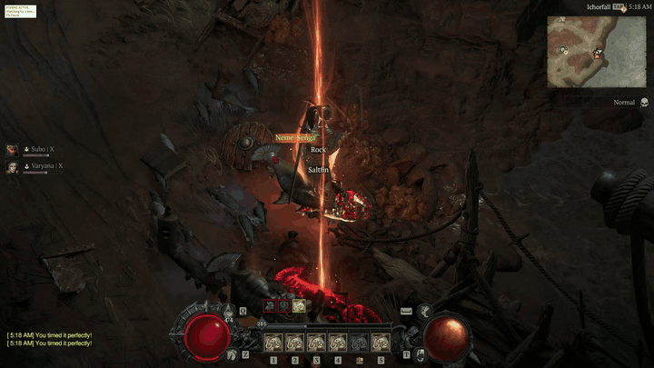

# Diablo IV Fishing Buddy

An AutoHotkey v1 script that automates Diablo IV fishing using GraphicSearch and color detection.

It can:

- Open the Action Wheel.
- Click Cast Fishing Line.
- Detect when fishing is active.
- Detect the cyan bite indicator.
- Press your configured reel key.
- Save detection areas and keybinds between launches.

Copyright (c) 2026 SuperMilkers. Released under the MIT License.

## Demonstration

## Community

Join the Discord for help, updates, and discussion:

https://discord.gg/gvgbacUHcN

## Requirements

- Windows 10 or Windows 11
- [AutoHotkey v1.1.37.02](https://www.autohotkey.com/download/1.1/AutoHotkey_1.1.37.02_setup.exe)
- [GraphicSearch](https://github.com/Chunjee/graphicsearch.ahk), included in the `engine` folder

AutoHotkey v2 is not compatible.

The script uses:

`#Requires AutoHotkey v1.1`

so AutoHotkey v1 and v2 can both be installed.

## Installation

1. Install AutoHotkey v1.1.37.02.
2. Download and extract this repository.
3. Confirm `engine\export.ahk` exists.
4. Start Diablo IV.
5. Move near fishable water and face the water.
6. Double-click `d4_fishing.ahk`.

If Windows opens it with the wrong AutoHotkey version:

`"C:\Program Files\AutoHotkey\v1.1.37.02\AutoHotkeyU64.exe" "C:\path\to\d4_fishing.ahk"`

## First-Time Setup

The script saves its settings in:

`d4_fishing.ini`

You normally only need to configure positions and keybinds once.

### 1. Set Positions

Press `F9`.

Three setup areas appear.

**BITE**  
Place the pink box around the area where the cyan bite indicator appears.

**FISHING STATE**  
Place the blue box around the fishing-state indicator.

**CAST BUTTON**  
Place the yellow ellipse over **Cast Fishing Line** on the Action Wheel.

To position an area:

1. Click an area to select it.
2. Drag the selected area with the mouse to move it.
3. Use the arrow keys to resize it.

Resize controls:

- `Up` = Taller
- `Down` = Shorter
- `Right` = Wider
- `Left` = Narrower

Resize speed:

- `Arrow` = 25 pixels
- `Shift + Arrow` = 75 pixels
- `Ctrl + Arrow` = 200 pixels

Press `F9` again to save all positions.

The script remembers them for future launches.

### 2. Set Keybinds

Press `F10`.

The script asks for two Diablo IV keybinds:

1. Press your **Action Wheel** key.
2. Press your **Reel** key.

Defaults:

- Action Wheel: `E`
- Reel: `5`

Both keys are saved automatically in `d4_fishing.ini`.

Do not assign `F8`, `F9`, `F10`, or `F12`. These are reserved by Fishing Buddy.

## Hotkeys

| Hotkey | Action |
| --- | --- |
| `F8` | Pause / Start Fishing |
| `F9` | Set Positions |
| `F10` | Set Keybinds |
| `F12` | Quit |

The status panel in the upper-left corner of the Diablo IV window also displays these shortcuts.

## Starting Fishing

1. Stand near fishable water.
2. Face the water.
3. Press `F8`.

The script will:

1. Check whether fishing is active.
2. Open the Action Wheel when it needs to cast.
3. Randomly click inside the saved Cast Fishing Line ellipse.
4. Detect the fishing state.
5. Watch the saved BITE area for cyan.
6. Press the saved reel key when a bite is detected.
7. Cast again when needed.

After the first cast, the script zooms in automatically to improve detection.

## Gameplay Notes

- Fish on a low difficulty such as Normal.
- Face fishable water before starting.
- Fish must be picked up manually.
- Equip some Thorns in case nearby enemies attack or fishing spawns an enemy.
- If **Diablo reconnecting** appears, wait for it to clear.
- If you change resolution, UI scale, monitor, or window layout, press `F9` and reposition the areas.

## Rare Fish Locations

These six yellow Rare fish are required for **The One That Got Away**.

| Rare Fish | Region | Suggested Location |
| --- | --- | --- |
| Augur of Civo | Dry Steppes | Beach west of Ked Bardu |
| Morayaga | Fractured Peaks | Bridge east of Yelesna |
| Crookfish | Hawezar | Walkway east of Backwater |
| Zakarati | Kehjistan | Docks southwest of Gea Kul |
| Neme-Senga | Nahantu | Pier west of Kurast Docks |
| Drakonbeard | Scosglen | Pier west of Marowen |

Catch the yellow **Rare** version and use it from your inventory to register it.

Legendary and Unique versions do not count.

### Fractured Peaks

Travel southeast from Kyovashad to **Yelesna** and fish from the bridge on the east side of town.

**Marowen is in Scosglen**, not Fractured Peaks.

## Trawghll Murloc Pet

**Trawghll** is a Murloc pet reportedly obtained from the Mythic **Gurgling Bag of Rubbish** while fishing.

- It can reportedly drop in any region.
- There is no confirmed best location.
- Completing the fish collection is not required.
- The drop is extremely rare.

## How It Works

The script uses three saved screen regions:

**BITE**  
Searches only the configured area for cyan pixels associated with the bite indicator.

**FISHING STATE**  
Uses GraphicSearch inside the configured area to determine whether fishing is active.

**CAST BUTTON**  
Defines an ellipse over Cast Fishing Line. The script chooses a random safe point inside the ellipse when casting.

The script also uses cooldowns and detection latches to prevent repeated actions.

## Troubleshooting

### Fishing does not start

- Confirm you are facing fishable water.
- Press `F9` and verify all three areas are positioned correctly.
- Make sure the Cast Button ellipse covers **Cast Fishing Line**.

### Bite is not detected

Press `F9` and make sure the pink **BITE** box covers the cyan bite indicator area.

Keep the box as small as practical for faster and more reliable detection.

### Script keeps trying to cast

The **FISHING STATE** box may be positioned incorrectly.

Press `F9` and move the blue box over the fishing-state indicator.

### Cast click misses the button

Press `F9` and reposition or resize the **CAST BUTTON** ellipse so it stays completely inside the Cast Fishing Line button.

### Wrong keys are being pressed

Press `F10` and set:

1. Action Wheel key
2. Reel key

The new values are saved automatically.

### After changing monitor or resolution

Press `F9` and reposition the three areas.

The status panel automatically follows the Diablo IV window when the game is moved between monitors.

### Keyboard input does not reach Diablo IV

Run Diablo IV and the script at the same privilege level.

If Diablo IV is running as administrator, run the script as administrator too.

## Disclaimer

This is an unofficial community project and is not affiliated with or endorsed by Blizzard Entertainment.

Automation may be restricted by a game's terms or rules. You are responsible for deciding whether and where to use this script.

## License

Diablo IV Fishing Buddy is licensed under the MIT License. See [LICENSE](LICENSE) for the complete text.

GraphicSearch is a third-party dependency with its own license. Preserve its original copyright and license notices when redistributing its files.
