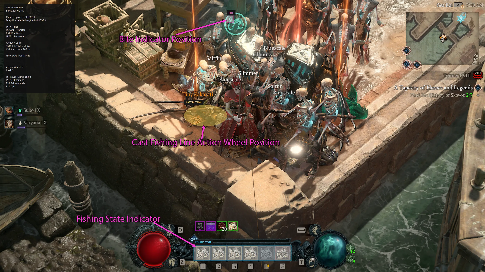

# Diablo IV Fishing Buddy

An AutoHotkey v1 script that automatically casts, detects bites, and reels in fish in Diablo IV using GraphicSearch and color detection.

### Features

- Automatically opens the Action Wheel and casts.
- Detects when fishing is active.
- Detects the bite indicator and reels automatically.
- Automatically recasts after each catch.
- Configurable detection areas and keybinds.
- Saves your configuration between launches.

Copyright (c) 2026 SuperMilkers. Released under the MIT License.

## Demonstration

## Requirements

- Windows 10 or Windows 11
- [AutoHotkey v1.1.37.02](https://www.autohotkey.com/download/1.1/AutoHotkey_1.1.37.02_setup.exe)
- [GraphicSearch](https://github.com/Chunjee/graphicsearch.ahk), included in the `engine` folder

> AutoHotkey v2 is not compatible with this script.

The script uses `#Requires AutoHotkey v1.1`, so AutoHotkey v1 and v2 can both be installed on the same computer.

## Installation

1. Install AutoHotkey v1.1.37.02.
2. Download and extract this repository.
3. Start Diablo IV.
4. Double-click `d4_fishing.ahk`.

If Windows attempts to run the script with AutoHotkey v2, launch it explicitly with v1:

`"C:\Program Files\AutoHotkey\v1.1.37.02\AutoHotkeyU64.exe" "C:\path\to\d4_fishing.ahk"`

## Hotkeys

| Hotkey | Action |
| --- | --- |
| `F8` | Start / Pause Fishing |
| `F9` | Set Positions |
| `F10` | Set Keybinds |
| `F12` | Quit |

The status panel in the upper-left corner of Diablo IV also displays these shortcuts.

## First-Time Setup

Fishing Buddy saves its configuration to `d4_fishing.ini`. Positions and keybinds normally only need to be configured once.

### 1. Set Positions

Press `F9` to display the three configurable areas:

- **BITE** - Place the pink box around the bite indicator.
- **FISHING STATE** - Place the blue box around the fishing-state indicator.
- **CAST BUTTON** - Place the yellow ellipse inside the **Cast Fishing Line** button on the Action Wheel.

To adjust an area:

1. Click the area to select it.
2. Drag it with the mouse to move it.
3. Use the arrow keys to resize it.

| Key | Action |
| --- | --- |
| `Up` / `Down` | Taller / Shorter |
| `Right` / `Left` | Wider / Narrower |
| `Arrow` | Resize 25 pixels |
| `Shift + Arrow` | Resize 75 pixels |
| `Ctrl + Arrow` | Resize 200 pixels |

Keep the **BITE** and **FISHING STATE** areas as small as practical while still covering their indicators. Smaller search areas improve detection performance.

Press `F9` again when finished to save all three positions.

### 2. Set Keybinds

Press `F10` and follow the prompts to set:

1. Your Diablo IV **Action Wheel** key.
2. Your **Reel** key.

Default keybinds:

| Action | Default |
| --- | --- |
| Action Wheel | `E` |
| Reel | `5` |

The selected keys are saved automatically to `d4_fishing.ini`.

`F8`, `F9`, `F10`, and `F12` are reserved by Fishing Buddy and cannot be assigned as Action Wheel or Reel keys.

## Start Fishing

1. Stand near fishable water and face the water.
2. Zoom in fully on your character for optimal detection.
3. Press `F8` to start fishing.

Fishing Buddy will automatically cast, detect bites, reel in catches, and recast as needed.

Press `F8` again at any time to pause fishing.

## Gameplay Notes

- Fish on a low difficulty such as Normal.
- Fish must be picked up manually.
- Equip some Thorns in case nearby enemies attack or fishing spawns an enemy.
- If **Diablo reconnecting** appears, wait for it to clear before fishing.
- After changing resolution, UI scale, monitor, or window layout, press `F9` and reposition the detection areas.

## Special Fish Locations

### Mythic Fish

There are five Mythic Unique fish hidden throughout Sanctuary. Each requires a special location or fishing condition.

| Mythic Fish | Condition | Location |
| --- | --- | --- |
| Ghoulworm | Pools of Blood | Small blood pools northeast of Tirmair in Scosglen |
| Molten Martyr | Pools of Lava | Fish in lava; Skartara and the lava areas southwest of Cerrigar are reliable locations |
| Fang of Tathamet | Helltide | Fish in a coastal fishing area while that region has an active Helltide |
| Dune Thresher Hatchling | Sandy Dunes | Sand dunes north of Tarsarak in Kehjistan |
| Vivid Whimsy | Cow Island / Scylara | Fish near the unicorn/cow bones on Cow Island after gaining access through the secret Cow Level questline |

After catching a new Mythic fish, use it from your **Consumables** inventory to add it to your collection.

### Quest Fish

#### Favor for a Favor

Shi Yugong asks you to catch three fish in Skovos.

| Fish | Region | Location |
| --- | --- | --- |
| Kokalodon | Skovos | Fish from Shi Yugong's Haven or another valid Skovos fishing spot |
| Silverbelly | Skovos | Fish from Shi Yugong's Haven or another valid Skovos fishing spot |
| Darkling | Skovos | Fish from Shi Yugong's Haven or another valid Skovos fishing spot |

Catch the yellow **Rare** version of each fish and use it from your **Consumables** inventory to register it.

#### The One That Got Away

This quest requires six yellow Rare fish, one from each major Sanctuary region.

| Fish | Region | Suggested Location |
| --- | --- | --- |
| Augur of Civo | Dry Steppes | Beach west of Ked Bardu |
| Morayaga | Fractured Peaks | Bridge east of Yelesna |
| Crookfish | Hawezar | Walkway east of Backwater |
| Zakarati | Kehjistan | Docks southwest of Gea Kul |
| Neme-Senga | Nahantu | Pier west of Kurast Docks |
| Drakonbeard | Scosglen | Pier west of Marowen |

These fish are **region-specific rather than tied to one exact fishing spot**, so the locations above are convenient places to catch them.

Catch the yellow **Rare** version and use it from your **Consumables** inventory to register it. Legendary and Unique versions do not count toward the quest.

#### The Fish of Dreams

After completing **The One That Got Away**, Shi Yugong gives you the final fishing quest, **The Fish of Dreams**.

| Quest Fish | Location |
| --- | --- |
| Red-Eyed Fish | Vision's End, in the cave north of Temis in Skovos |

Fish inside **Vision's End** until you catch the Red-Eyed Fish, then continue the quest with Shi Yugong.

## Trawghll Murloc Pet

**Trawghll** is an extremely rare secret Murloc pet obtained exclusively through fishing.

The pet is obtained from a Mythic-rarity **Gurgling Bag of Rubbish**, which has an exceptionally small chance to be caught while fishing.

### What We Know

- **Gurgling Bag of Rubbish** is a Mythic fishing drop that unlocks Trawghll.
- It can be caught through normal fishing and does not appear to require a special fishing location.
- There is no confirmed best region or fishing spot.
- Completing the fish collection is **not required**.
- Completing the fishing quests is **not required**.
- Catching every Mythic fish is **not required**.
- There is no confirmed evidence that higher Torment difficulty improves the drop rate.
- The drop is entirely RNG and can take an extremely long time to obtain.

### Drop Rate

The exact drop rate has **not been officially confirmed**.

Community estimates frequently place it around **0.01% or lower**, but these numbers should not be considered official. Player experiences vary enormously, with some obtaining Trawghll after only several hours and others reporting tens of thousands of casts without seeing the Mythic bag.

Because there are no known prerequisites or location requirements, the most efficient approach is simply to fish somewhere safe where casts can be repeated quickly.

Once obtained, use the **Gurgling Bag of Rubbish** to unlock Trawghll as a pet.

## How It Works

Fishing Buddy monitors three configurable areas of the Diablo IV window:

**BITE**  
Detects the bite indicator and triggers the configured Reel key.

**FISHING STATE**  
Uses GraphicSearch to determine whether fishing is currently active.

**CAST BUTTON**  
Defines the safe area of the **Cast Fishing Line** button. When a new cast is needed, Fishing Buddy opens the Action Wheel and clicks a randomized point inside this ellipse.

Cooldowns and detection latches prevent duplicate actions and repeated key presses.

## Troubleshooting

### Fishing does not start

- Make sure you are near fishable water and facing the water.
- Press `F9` and verify the three detection areas.
- Make sure the **CAST BUTTON** ellipse is completely inside **Cast Fishing Line**.

### Bites are not detected

Press `F9` and verify that the **BITE** box covers the bite indicator.

Keep the box as small as practical while still covering the complete indicator.

### Fishing Buddy keeps trying to cast

The **FISHING STATE** area may not be detecting the fishing indicator.

Press `F9` and reposition the blue box around the fishing-state indicator.

### Cast misses the button

Press `F9` and reposition or resize the **CAST BUTTON** ellipse so it remains completely inside **Cast Fishing Line**.

### Wrong keys are being pressed

Press `F10` and reconfigure your Action Wheel and Reel keys.

### Detection stopped working after changing resolution or monitors

Press `F9` and reposition the detection areas.

The status panel automatically follows the Diablo IV window when the game is moved between monitors.

### Keyboard input does not reach Diablo IV

Run Diablo IV and Fishing Buddy at the same privilege level.

If Diablo IV is running as administrator, run `d4_fishing.ahk` as administrator as well.

## Community

For help, updates, and discussion, join the Discord:

https://discord.gg/gvgbacUHcN

## Disclaimer

Diablo IV Fishing Buddy is an unofficial community project and is not affiliated with or endorsed by Blizzard Entertainment.

Automation may be restricted by a game's terms or rules. You are responsible for deciding whether and where to use this script.

## License

Diablo IV Fishing Buddy is licensed under the MIT License. See [LICENSE](LICENSE) for the complete license text.

GraphicSearch is a third-party dependency with its own license. Preserve its original copyright and license notices when redistributing its files.